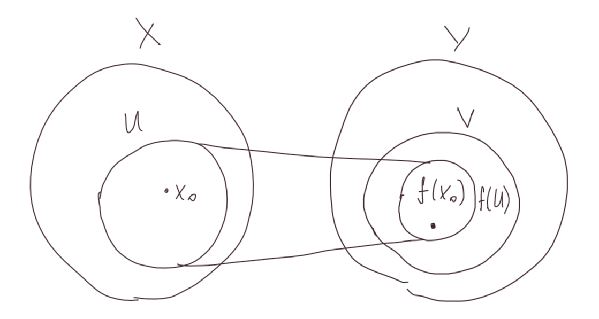

## Топология и топологическое пространство

---

**Определение:** Пусть задано множество $X$ и некоторое семейство его подмножеств $\tau$. Тогда $\tau$ - *топология* на множестве $X$, если выполнены следующие аксиомы:

1. $\varnothing \in \tau$ и $X \in \tau$.
2. Любое объединение множеств из $\tau$ является элементом $\tau$
3. Любое конечное пересечение множеств из $\tau$ является элементом $\tau$.

**Определение:** Пара $(X, \tau)$, где $X$ - множество, а $\tau$ - топология на нем - *топологическое пространство*.

**Определение:** Пусть $(X, \tau)$ - топологическое пространство. Элементы множества $X$ - *точки*.

**Определение:** Пусть $(X, \tau)$ - топологическое пространство. Множество $U \in \tau$ - *окрестность точки* $x \in X$, если $x \in U$.

**Определение:** Пусть $(X, \tau)$ - топологическое пространство. Множества $U \in \tau$ - *открытые* в топологическом пространстве $(X, \tau)$.

**Утверждение:** Множество всех подмножеств $X$ - это топология.

**Определение:** Такая топология называется *дискретной* и обозначается $\tau_d$.

**Определение:** Топология, состоящая из самого множества $X$ и пустого множества $\varnothing$ называется *тривиальная* и обознаяается $\tau_0$.

## Метрическая топология

---

**Определение:** Пусть $X$ - множество. Отображение $\rho: X\times X \to \mathbb{R}$ - *метрика*, если:

1. $\forall x, y \in X \,\,\,\, \rho(x, y) \ge 0$, причем $\rho(x, y) = 0 \Leftrightarrow x = y$.
2. $\forall x, y \in X \,\,\,\, \rho(x, y) = \rho(y, x)$.
3. $\forall x, y, z \in X \,\,\,\, \rho(x, y) + \rho(y, z) \ge \rho(x, z)$.

**Определение:** Пара $(X, \rho)$, где $X$ - множество, а $\rho$ - метрика на нем - *метрическое пространство*, элементы множества $X$ - *точки*, $\forall x, y \in X \,\,\,\, \rho(x, y)$ - *расстояние между точками* $x$ и $y$.

**Определение:** Пусть $V$ - линейное пространство над полем $\mathbb{R}$. Отображение $h: V \to \mathbb{R}$ - *норма*, если:

1. $\forall x \in V \,\,\,\, h(x) \ge 0$, причем $h(x) = 0 \Leftrightarrow x = 0$.
2. $\forall x \in V, \,\,\,\, \lambda \in \mathbb{R} \,\,\,\, |\lambda| h(x) = h(\lambda x)$.
3. $\forall x, y \in V \,\,\,\, h(x + y) \le h(x) + h(y)$. 

**Определение:** Пусть $(X, \rho)$ - метрическое пространство. *Открытый шар радиуса* $\varepsilon$ *с центром в точке* $x \in X$ - это множество $\{y \in X| \,\,\,\, \rho(x, y) < \varepsilon\}$. Обозначается: $O_{\varepsilon}(x)$. Пусть $A \subset X$. Точка $x$ - *внутренняя точка* множества $A$, если $\exists O_{\varepsilon}(x) \subset A$. Множество всех внутренних точек $A$ - *внутренность* $A$. Обозначается: $\operatorname{Int} A$. Множество $A$ - *открыто* в метрическом пространстве $(X, \rho)$, если $\operatorname{Int} A = A$.

**Утверждение:** Пусть $(X, \rho)$ - метрическое пространство. Тогда любое объединение открытых в $(X, \rho)$ множеств открыто в $(X, \rho)$, а любое конечное пересечение открытых в $(X, \rho)$ множеств открыто в $(X, \rho)$.

*Доказательство:*

**Следствие:** Пусть $(X, \rho)$ - метрическое пространство. Тогда семейство всех открытых в $(X, \rho)$ множеств - топология на $X$.

**Определение:** Пусть $(X, \rho)$ - метрическое пространство. Топология, состоящая из всех открытых в $(X, \rho)$ множеств называется *метрической* и обозночается $\tau_{\rho}$.

## Топология на базе окрестностей

---

**Определение:** Пусть $X$ - множество. Тогда семейство $\beta$ его подмножеств - *база окрестностей*, если:

1. $\forall x \in X \,\,\,\, \exists U \in \beta: \,\,\,\, x \in U$.
2. $\forall U, W \in \beta: \,\,\,\, \exists x \in X, \,\,\,\, x \in U \cap W \,\,\,\, \exists V \in \beta: \,\,\,\, x \in V \subset U \cap W$.

Элементы множества $X$ - *точки*.

Любое множество $U \in \beta: \,\,\,\, x \in U$ - $\beta$-*окрестность точки* $x$.

Подмножество $A$ множества $X$ - *открыто*, если каждая его точка содержится в $A$ вместе с какой-то своей $\beta$-окрестностью. Пустое множество открыто по определению.

**Утверждение:** Каждый элемент базы окрестностей открытое множество для этой базы.

**Утверждение:** Для любого непустого конечного пересечения элементов базы и любого элемента этого пересечения существует элемент базы, содержащийся в этом пересечении и содержащий элемент пересечения. (Интересно, это возможно понять?)

**Утверждение:** Пусть задано множество $X$ и его база окрестностей $\beta$. Множество $A \subset X$ - открыто $\Leftrightarrow A = \displaystyle\cup U_{\alpha}, \,\,\,\, U_{\alpha} \in \beta$.

**Утверждение:** Пусть задано множество $X$ и его база окрестностей $\beta$. Тогда множество $\tau_{\beta}$ всех открытых относительно базы $\beta$ множеств - топология на $X$.

**Определение:** $\tau_{\beta}$ - *топология с базой* $\beta$.

## Замкнутые подмножества

---

**Определение:** Пусть задано топологическое пространство $(X, \tau)$. $A \subset X$ - *замкнуто*, если его *дополнение* $X \setminus A$ открыто.

**Утверждение:** (свойства замкнутых подмножеств) Пусть задано топологическое пространство $(X, \tau)$. Тогда

1. $\varnothing$ и $X$ замкнуты.
2. Любое пересечение замкнутых множеств замкнуто.
3. Любое конечное объединение замкнутых множеств замкнуто.

*Доказательство:*

**Определение:** Пусть задано метрическое пространство $(X, \rho)$.

Точка $X \in X$ - *точка прикосновения* множества $A \subset X$, если $\forall O_{\varepsilon}(x) \,\,\,\, O_{\varepsilon}(x) \cap A \ne \varnothing$.

Множество всех точек прикосновения множества $A \subset X$ - *замыкание* $A$. Обозначается: $\operatorname{Cl}A$.

Множество $A \subset X$ - *замкнуто*, если $\operatorname{Cl}A = A$.

**Утверждение:** Пусть задано метрическое пространство $(X, \rho)$. Тогда множество $A \subset X$ открыто $\Leftrightarrow X \setminus A$ замкнуто.

*Доказательство:*

## Топологические внутренность и замыкание

---

**Определение:** Пусть $(X, \tau)$ - топологическое пространство, $A \subset X$.

Точка $x \in X$ *внутренняя (точка)* множества $A$, если существует ее окрестность, содержащаяся в $A$.

Точка $x \in X$ *точка  прикосновения* множества $A$, если пересечение любой ее окрестности с $A$ непусто.

**Определение:** Пусть $(X, \tau)$ - топологическое пространство, $A \subset X$. 

Множество всех внутренних точек $A$ - *внутренность* $A$.

Обозначается: $\operatorname{Int} A$.

Множество всех точек прикосновения $A$ - *замыкание* $A$.

Обозначается: $\operatorname{Cl} A$.

**Утверждение:** Пусть $(X, \tau)$ - топологическое пространство, $A \subset X$. Тогда 

$A$ замкнуто $\Leftrightarrow \operatorname{Cl}A = A$.

$A$ открыто $\Leftrightarrow \operatorname{Int}A = A$.

**Утверждение:** Пусть топология на $X$ задана с помощью базы окрестностей $\beta$. Тогда 

$x \in X$ - внутренняя точка $A \subset X \Leftrightarrow \exists U \in \beta: \,\,\,\, x \in U \subset A$,

$x \in X$ - точка прикосновения $A \subset X \Leftrightarrow \forall U \in \beta: \,\,\,\, x \in U \,\,\,\, U \cap A \ne \varnothing$.

*Доказательство:*

**Определение:** Топологическая *граница* множества $A \subset X$ - это $\operatorname{Cl}A \setminus \operatorname{Int}A$.

## Непрерывные отображения

---

**Определение:** Пусть заданы топологические пространства $(X, \tau_x)$ и $(Y, \tau_y)$. Отображение $f: X \to Y$ *непрерывно в точке* $x_0 \in X$, если для каждой окрестности $V$ точки $f(x_0)$ в $Y$ существует окрестность $U$ точки $x_0$ в $X$, такая что $f(U) \subset V$.

$f$ *непрерывно*, если оно непрерывно в каждой точке $x \in X$.

**Определение:** Пусть заданы топологические пространства $(X, \tau_x)$ и $(Y, \tau_y)$, непрерывное отображение $f: X \to Y$. 

$x \in X$ *прообраз* точки $y \in Y$, если $f(x) = y$.

$f^{-1}(y) = \{x \in X: \,\,\,\, f(x) = y\}$ - *полный прообраз* точки $y in Y$.

$A \subset Y, \,\,\,\, f^{-1}(A) = \{x \in X: \,\,\,\, f(x) \in A\}$ - *прообраз множества* $A$.

**Утверждение:** (простейшие свойства прообраза) Пусть заданы топологические пространства $(X, \tau_x)$ и $(Y, \tau_y)$, непрерывное отображение $f: X \to Y$, $\{A_{\alpha}\}$ - семейство подмножеств $Y$.

1. $f^{-1}(\varnothing) = \varnothing$ и $f^{-1}(Y) = X$.
2. $f^{-1}(\displaystyle\cup_{\alpha} A_{\alpha}) = \displaystyle\cup_{\alpha}f^{-1}A_{\alpha}$.
3. $f^{-1}(\displaystyle\cap_{\alpha} A_{\alpha}) = \displaystyle\cap_{\alpha}f^{-1}A_{\alpha}$.
4. $f^{-1}(Y \setminus A) = X \setminus f^{-1}A$.

*Доказательство:*

**Теорема:** Пусть заданы топологические пространства $(X, \tau_x)$ и $(Y, \tau_y).$ Тогда следующие условия эквивалентны:

1. Отображение $f: X \to Y$ непрерывно.
2. Прообраз любого открытого в $Y$ множества открыт в $X$.
3. Прообраз любого замкнутого в $Y$ множества замкнут в $X$.

*Доказательство:* 

**Следствие:** Композиция непрерывных отображений непрерывна.

 