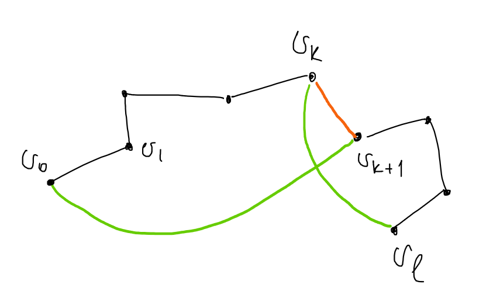
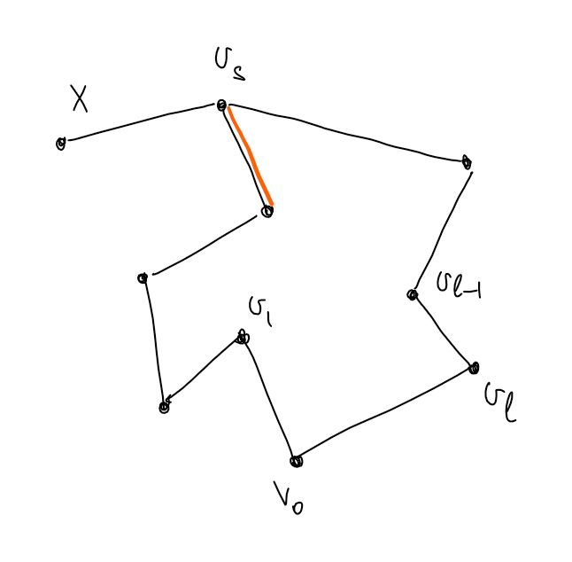

## Граф: определения

---

**Определение:** $V^{(k)}$ - это множество всех $k$-элементных подмножеств множества $V$.

**Определение:** *Граф* - это тройка $\{E, V, \sigma\}$, где 
$E$ - *множество ребер* ($e \in E$ - *ребро*) 
$V$ - *множество вершин* ($v \in V$ - *вершина*) 
$\sigma: \,\,\,\, E \to V^{(1)} \cup V^{(2)}$ - *отношение инцидентности ребер и вершин*.
 
 
Если $\sigma(e) \in V^{(1)}$, то $e$ - *петля*. 
Если $\sigma(e) \in V^{(2)} = \{u, v\}$, то вершина $u$ *смежная* (*соседняя к*) вершине $v$. 
Если $v \in \sigma(e)$, то вершина $v$ *инцидентна* ребру $e$. 
Если $\sigma(e) = \sigma(e’)$, то $e$ и $e’$ *кратные ребра*. 

**Определение:** Граф *простой*, если в нем нет петель и кратных ребер. 

Часто записывается $G = \{E, V\}$, вместо $\{E, V, \sigma\}$.

**Определение:** *Степень вершины* $v \in V$ графа $G = \{E, V, \sigma\}$ - это сумма количества ребер инцидентных $v$ и не являющихся петлями и удвоенного количества петель инцидентных $v$.
Обозначается: $\operatorname{deg}v$.

**Утверждение:** $$\displaystyle \sum_{v \in V}\operatorname{deg}v = 2|E|$$

*Доказательство:* $\,\,\,\,\blacksquare$

**Определение:**
*Маршрут* (между вершинами $v_0$ и $v_k$) в графе $G = \{E, V, \sigma\}$ - это последовательность $v_0, e_1, v_1, e_2, v_2, \ldots, e_k, v_k$, где $v_i \in V \,\,\,\,\forall i \in \{0, \ldots, k\}, \,\,\,\, e_i \in E \,\,\,\,\forall i \in \{1, \ldots, k\}$ и ребро $e_i$ индицентно вершинам $v_{i - 1}$ и $v_i$. 
 
Если в маршруте $\forall i \ne j \,\,\,\, e_i \ne e_j$, то маршрут - это *цепь*. 
Если в маршруте $v_0 = v_k$, то маршрут *замкнутый*. 
Замкнутая цепь - это *цикл*. 
Если в маршруте $\forall i \ne j \ne 0 \ne k \,\,\,\, v_i \ne v_j$, то маршрут - это *путь*. 
Замкнутый путь - это *простой цикл*.

**Определение:** Граф $G = \{E, V , \sigma\}$ *связный*, если $\forall u, v \in V$ существует маршрут между $u$ и $v$. 

## Эйлеров граф

---

**Определение:** *Эйлеров обход графа (эйлеров цикл)* - это цикл, содержащий все вершины графа.

**Определение:** Если в графе существует эйлеров цикл, то граф - *эйлеров*.

**Теорема:** Граф эйлеров $\Leftrightarrow$ граф связный и степени всех вершин графа четны.

*Доказательство:* $$\Rightarrow$$
Граф эйлеров, значит существует цикл, содержащий все вершины графа. Идя по этому циклу, в каждую вершину нужно зайти и выйти, то есть степень любой вершины четна.

$$\Leftarrow$$

Степени всех вершин четны, граф конечный и связный. Начнем в какой-нибудь вершине и будем строить цикл, выбирая каждый раз следующей непосещенную вершину, так как граф конечный этот процесс завершится и будет получен искомый цикл $\,\,\,\,\blacksquare$ (Плохо)

## Гамильтонов граф

---

**Определение:** *Гамильтонов цикл* - это простой цикл, проходящий через все вершины графа.

**Определение:** Граф *гамильтонов*, если в нем есть гамильтонов цикл.

**Утверждение:** Пусть $G = \{E, V, \sigma\}$ гамильтонов граф.

1. $G$ связный.
2. Если $|V| > 1$, то в $G$ нет петель.
3. Если $|V| > 2$, то в $G$ нет кратных ребер.

*Доказательство:*

1. Гамильтонов цикл проходит через все вершины.
2. Гамильтонов цикл проходит через вершину ровно один раз.
3. см 2. $\,\,\,\,\blacksquare$

То есть для определения гамильтоновости графа достаточно рассматривать простые графы.

**Теорема:** (Дирака) Пусть $G = \{E, V, \sigma\}$ - простой граф, $|V| = n, \,\,\,\, n \ge 3, \,\,\,\, \forall v \,\,\,\, \operatorname{deg}v \ge \frac{n}{2}$. Тогда $G$ гамильтонов.

*Доказательство:* 

Идея: Построить самый длинный путь в графе $G$. Пусть его длина $l$. Доказать, что можно получить цикл длины $l + 1$. Предположить, что полученный цикл не гамильтонов. Прийти к противоречию. Всё!

Пусть $\gamma = v_0v_1\ldots v_{l-1}v_l$ самый длинный путь в графе. Докажем существование цикла длины $l + 1$.
Если $v_0$ и $v_l$ смежны, то таким циклом является последовательность $v_0v_1\ldots v_{l-1}v_lv_0$.
Иначе хотим найти вершину $v_k \in \gamma$, такую чтобы следующая за ней в пути вершина была смежна с $v_0$, а сама $v_k$ была смежна с $v_l$ (см. рисунок). Если доказать существование такой вершины, то искомым циклом будет $v_0\ldots v_kv_l\ldots v_{k + 1}v_0$ (на рисунке черный путь + оранжевое ребро - это $\gamma$, а черные ребра + зеленые - это искомый цикл).

Рассмотрим множества: $X = \{v_i: \,\,\,\, v_iv_l \in E\}$ и $Y = \{v_i: \,\,\,\, v_{i + 1}v_0 \in E\}$.
Все вершины смежные с $v_0$ принадлежат пути, потому что иначе можно было бы увелечить длину пути.
$|X| = \operatorname{deg}v_l \ge \frac{n}{2}, \,\,\,\, |Y| = \operatorname{deg}v_0 \ge \frac{n}{2} \Rightarrow |X| + |Y| \ge n$. Пусть $X \cap Y = \varnothing$. Тогда $|X \cup Y| = |X| + |Y| \ge n$, но вершина $v_l \not \in X$ и $v_l \not \in Y \Rightarrow$ в графе больше $n$ вершин. Противоречие, а значит $\exists v_k: \,\,\,\, v_k \in X \cap Y$.

Докажем, что полученный цикл $C$ гамильтонов. Предположим обратное, тогда $\exists v \in V: \,\,\,\, v \not\in \gamma$. Пусть $v$ смежна с вершиной $v_s$ из цикла $C$. Тогда выбросив любое из смежных с $v_s$ ребер, принадлежащих $C$ получим путь длины $l + 1$. Противоречие. Значит $v$ не смежна ни с одной вершиной $C$. Вершин смежных с $v \ge \frac{n}{2}$. Вершин смежных с $v_0 \ge \frac{n}{2}$ и все они принадлежат $C$. Значит в графе больше, чем $n$ вершин. Противоречие. Следовательно, $C$ гамильтонов цикл $\,\,\,\,\blacksquare$

## Подграфы

---

**Определение:** $H = (V_H, E_H, \sigma_H)$ *подграф* графа $G = (V_G, E_G, \sigma_G)$, если $V_H \subset V_G, \,\,\,\, E_H \subset E_G, \,\,\,\, \sigma_H = \sigma_G |_{E_H}$.

**Определение:** Подграф *остовный*, если содержит все вершины исходного.

**Определение:** Пусть $M \subset V, \,\,\,\, G = (V, E, \sigma)$. Обозначим $G(M) = (M, E_M = \{\sigma^{-1}(M^{(1)} \cup M^{(2)}), \sigma |_{E_M}\})$.

**Утверждение:** Пусть $M \subset V, \,\,\,\, G = (V, E, \sigma)$. Тогда $G(M)$ - подграф $G$.

*Доказательство:* очев $\,\,\,\,\blacksquare$

**Определение:** Пусть $G = (V, E, \sigma), \,\,\,\, w \in W, \,\,\,\, v \in V$. 

$w ~\sim v$ (*эквивалентно*), если существует маршрут из $w$ в $v$.

**Утверждение:** Введенная выше "$\sim$" является отношением эквивалентности на множестве вершин графа.

*Доказательство:* 

**Определение:** Класс эквивалентности вершины $v$ графа $G$ обозначается $[v]$.

**Определение:** *Компонента связности* вершины $v$ графа $G$ - это максимальный по включению подграф, содержащий $v$.

**Утверждение:** $G([v])$ - это компонента связности вершины $v$.