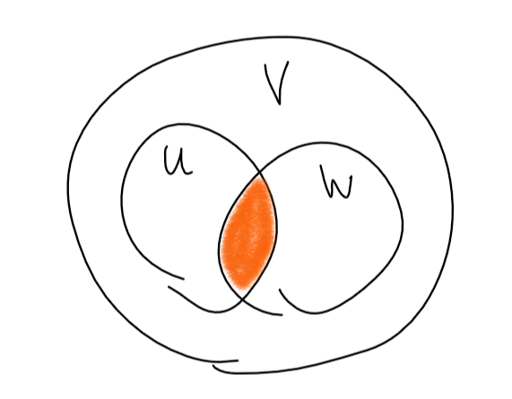

## Переход от одного базиса к другому

---

Это было слишком много раз, чтобы писать заново.

Матрица перехода от базиса $e$ к базису $e’$ обозначается $C_{e \to e’}$.

### Свойства матрицы перехода

**Утверждение:** (свойства матрицы перехода)

Пусть $e, e’, e’’$ - базисы в некотором конечномерном векторном пространстве.

1. $C_{e \to e’}$ - невырождена.
2. $C_{e \to e} = E$.
3. $C_{e’ \to e} = C_{e \to e’}^{-1}$.
4. $C_{e \to e’}\cdot C_{e’ \to e’’} = C_{e’ \to e’’}$.

*Доказательство:* $\,\,\,\,\blacksquare$

## Сумма и пересечение векторных подпространств

---

**Утверждение:** Пусть $U, \,\,\,\, W$ подпространства векторного пространства $V$. Тогда $U \cap W$ подпространство $V$.

*Доказательство:* Проверим по определению.

1. $0$ принадлежит и $U$, и $W \Rightarrow$ принадлежит и пересечению.
2. Пусть $x, y \in U \cap W$, тогда $x + y \in U \cap W$.
3. $\,\,\,\,\blacksquare$

**Определение:** Пусть $U, \,\,\,\, W$ подпространства векторного пространства $V$. *сумма* $U + W$ подпространств $U$ и $W$ - это $U + W = \{u + w: \,\,\,\, u \in U, \,\,\,\, w \in W\}$.

**Утверждение:** Пусть $U, \,\,\,\, W$ подпространства векторного пространства $V$. Тогда $U + W$ - подпространство в $V$.

*Доказательство:* $\,\,\,\,\blacksquare$

**Теорема:** (формула кого-то там (Грассмана))
Пусть $U, \,\,\,\, W$ подпространства векторного пространства $V$.
$$\dim U + \dim W = \dim (U \cap W) + \dim (U + W)$$

*Доказательство:*

Пусть $e_1, \ldots, e_k$ - базис в $U \cap W$, 
$e_1, \ldots, e_m$ - базис в $U$, 
$e_1, \ldots, e_k, e_{m + 1}, \ldots, e_{n}$ - базис в $W$. ($\dim W = n - m + k$).

Докажем, что $e_1, \ldots, e_n$ - базис в $U + W$.

1. Любой вектор $x \in U + W$ представим выражается через базисы $U$ и $W$, а следовательно через $e_1, \ldots, e_n$.
2. Докажем что эти векторы линейно независимы. Пусть $$\underbrace{\mu_1 e_1+\ldots+\mu_k e_k}_{\vec{a}} + \underbrace{\mu_{k + 1} e_{k + 1} + \ldots + \mu_m e_{m}}_{\vec{b}} + \underbrace{\mu_{m + 1} e_{m + 1} + \ldots + \mu_n e_n}_{\vec{c}} = 0$$ 
Поколдуем $\,\,\,\,\blacksquare$

## Прямая сумма подпространств

---

**Определение:** Пусть $U, \,\,\,\, W$ подпространства векторного пространства $V$. Сумма $U + W$ *прямая*, если $\forall x \in U + W \,\,\,\, \exists! \,\,u \in U, w \in W: \,\,\,\, u + w = x$.

Обозначается прямая сумма так: $U \oplus W$.

**Утверждение:** Пусть $U, \,\,\,\, W$ подпространства векторного пространства $V$. Тогда $U + W$ - прямая $\Leftrightarrow U \cap W = \{0\}$.

*Доказательство:* $$\Rightarrow$$
Пусть $U \cap W \ne \{0\}$, тогда $\exists x \in U \cap W$. $x = x_{\in U} + 0_{\in W} = 0_{\in U} + x_{\in W}$, то есть существует два представления $x$. противоречие.

$$\Leftarrow$$
Пусть $U + W$ не прямая сумма, тогда $\exists x \in U + W: \,\,\,\, x = u’ + w’ = u + w, \,\,\,\, u’, u \in U, \,\,\,\, w’, w \in W$. Значит $u’ - u \in U = w - w’ \in W$, то есть $U \cap W \ne \{0\}$. Противоречие $\,\,\,\,\blacksquare$

**Утверждение:** Сумма подпространств $U = U_1 + U_2 + \ldots + U_n$ - прямая $\Leftrightarrow \,\,\,\, \forall i \in \{1, \ldots, n\} \,\,\,\, U_i \cap (U_{i + 1} + \ldots + U_n) = \{0\}$.

*Доказательство:*

$$\Rightarrow$$
см. доказательство выше.
$$\Leftarrow$$
Пусть сумма не является прямой, тогда $\exists u \in U: \,\,\,\, u = \Sigma u_i = \Sigma u_i’, \,\,\,\, u_i, u_i’ \in U$. Возьмем первую ненулевую разность $u_i - u_i’$ и остальное перенесем вправо: $u_i - u_i’ = -u_{i + 1} + u_{i + 1}’ + \ldots - u_{n} + u_{n}’$. Следовательно пересечение содержит не только нулевой вектор. Противоречие $\,\,\,\,\blacksquare$
